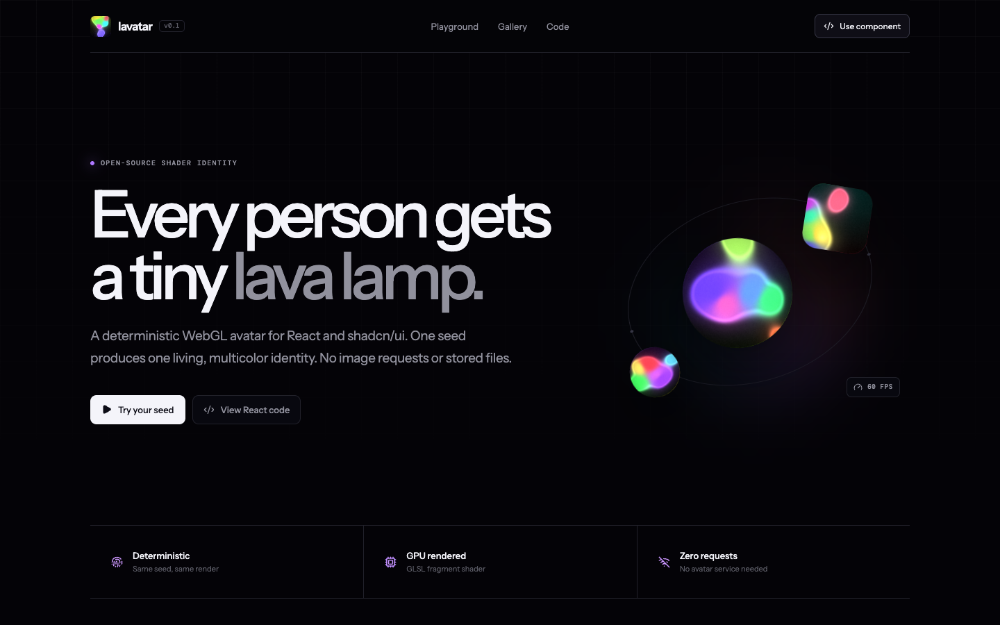

# Lavatar

Deterministic animated shader avatars for React and shadcn/ui.

[Live playground](https://lavatar.sonarvue.com/) · [MIT license](./LICENSE) · Built by [Sonarvue](https://www.sonarvue.com/)



Lavatar turns any stable string into a living visual identity. The same seed always produces the same colors, forms, and motion. Rendering happens locally in a WebGL2 canvas, with no avatar API, image request, or stored profile file.

## Install with shadcn

```bash
npx shadcn@latest add sonarvue/lavatar/lavatar
```

Pin the current release when you need reproducible installs:

```bash
npx shadcn@latest add sonarvue/lavatar/lavatar#v0.1.0
```

Then use the component from your project:

```tsx
import { Lavatar } from "@/components/ui/lavatar"

export function TeamMember() {
  return (
    <div className="flex items-center gap-3">
      <Lavatar
        seed="ada@example.com"
        label="Ada Lovelace"
        palette="aurora"
        shape="circle"
        size={64}
      />
      <span>Ada Lovelace</span>
    </div>
  )
}
```

## Why use it

- **Deterministic:** emails, user IDs, wallet addresses, and usernames map to stable visuals.
- **Zero network requests:** no image CDN or avatar service is required.
- **Source-first:** the shadcn CLI adds the TypeScript and GLSL directly to your codebase.
- **SSR-safe:** browser APIs are used only after the component mounts.
- **Accessible:** includes an image role, an accessible label, and reduced-motion support.
- **Resilient:** a CSS fallback remains visible when WebGL2 is unavailable.
- **Dependency-free at runtime:** React is the only peer dependency.

## Props

| Prop | Type | Default | Description |
|---|---|---|---|
| `seed` | `string` | required | Stable input used to generate the avatar. |
| `size` | `number \| string` | `96` | Pixel size or any valid CSS width value. |
| `shape` | `"rounded" \| "circle" \| "square"` | `"rounded"` | Canvas corner treatment. |
| `palette` | `"lava" \| "aurora" \| "nebula" \| "plasma" \| "mono"` | `"lava"` | Color family used by the shader. |
| `animated` | `boolean` | `true` | Enables slow shader motion. |
| `label` | `string` | generated | Accessible image label. |

Standard canvas props such as `className`, `style`, event handlers, and ARIA attributes are also supported.

## Privacy

The seed is normalized and hashed in the browser. Lavatar does not transmit it anywhere. Avoid rendering the original email or private identifier in surrounding markup if that value should not be public.

## Browser behavior

Animation requires WebGL2. Browsers without WebGL2 keep the deterministic CSS fallback. Users who enable reduced motion receive a stable, non-animated shader frame.

## Develop locally

```bash
npm install
npm run dev
```

Verify the demo and GitHub registry before opening a pull request:

```bash
npm run build
npm run registry:validate
```

## Registry

This public repository is a native [shadcn GitHub registry](https://ui.shadcn.com/docs/registry/github). Review [`registry.json`](./registry.json) to see the exact source file installed by the CLI.

```bash
npx shadcn@latest view sonarvue/lavatar/lavatar
npx shadcn@latest add sonarvue/lavatar/lavatar --dry-run
```

## License

MIT. Use it, modify the shader, and ship it in commercial products.

Lavatar is maintained by [Sonarvue](https://www.sonarvue.com/), an AI visibility platform for tracking how brands appear in answer engines.
